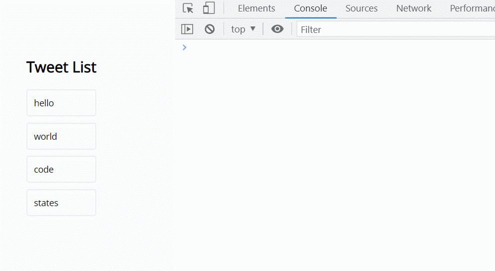

### Create

```jsx
document.createElement('div')
const tweetDiv = document.createElement('div')
```

→ `<div>` 요소 생성. 변수 `tweetDiv` 에 `div` 요소를 할당

<br>

<br>

### Read

```jsx
const oneTweet = document.querySelector('.tweet')
```

→ `querySelector`로 클래스 이름이 `tweet`인 HTML 요소 조회

```jsx
const tweets = document.querySelectorAll('.tweet')
```

→ `querySelectorAll` 로 클래스 이름이 `tweet`인 모든 HTML 요소를 유사 배열로 받아옴

```jsx
const container = document.querySelector('#container')
const tweetDiv = document.createElement('div')
container.append(tweetDiv)
```

→ `tweetDiv`를 `id= container`의 마지막 자식 요소로 추가.

<br>

<br>

### Update

```jsx
const oneDiv = document.createElement('div')
console.log(oneDiv)     // <div></div>

oneDiv.textContent = 'dev';
console.log(oneDiv)    // <div>dev</div>
```

→ `textContent` 를 사용하여 비어있는 `div` 엘리먼트에 문자열 입력

```jsx
oneDiv.classList.add('tweet')
console.log(oneDiv)  // <div class="tweet">dev</div>
```

→ css 스타일링 적용을 위해 `div` 엘리먼트에 `class` 추가

```jsx
const container = document.querySelector('#container')
container.append(oneDiv)
```

→ `append` 를 이용하여 `container` 의 자식 요소로 추가 



<br>

<br>

### Delete

(삭제하려는 요소의 위치를 알고 있는 경우)

```jsx
const container = document.querySelector('#container')
const tweetDiv = document.createElement('div')
container.append(tweetDiv)
tweetDiv.remove()
```

→ id가 `container` 인 요소 아래에 `tweetDiv`를 추가하고, `remove`로 삭제

여러개의 자식 요소를 지울때 `innerHTML` 이용

```jsx
document.querySelector('#container').innerHTML = '';
```

`removeChild` 자식 요소를 지정해서 삭제하는 메서드

```jsx
const container = document.querySelector('#container')
while (container.firstChild) {
    container.removeChild(container.firstChild);
}
```

→ 자식 요소가 남아있지 않을때까지, 첫번째 자식 요소를 삭제

→ `container` 에 첫번째 자식 요소가 존재하면, 첫번째 자식 요소를 제거


```jsx
while (container.children.length > 1) {
  container.removeChild(container.lastChild);
}
```

→ `container` 의 자식 요소가 1개만 남을때까지, 마지막 자식 요소를 제거

```jsx
const tweets = document.querySelectorAll('.tweet')
tweets.forEach(function(tweet) {
	tweet.remove();
})

// or

for (let tweet of tweets) {
	tweet.remove()
}
```

→ 직접 클래스 이름이 `tweet` 인 요소만 찾아서 제거하기

